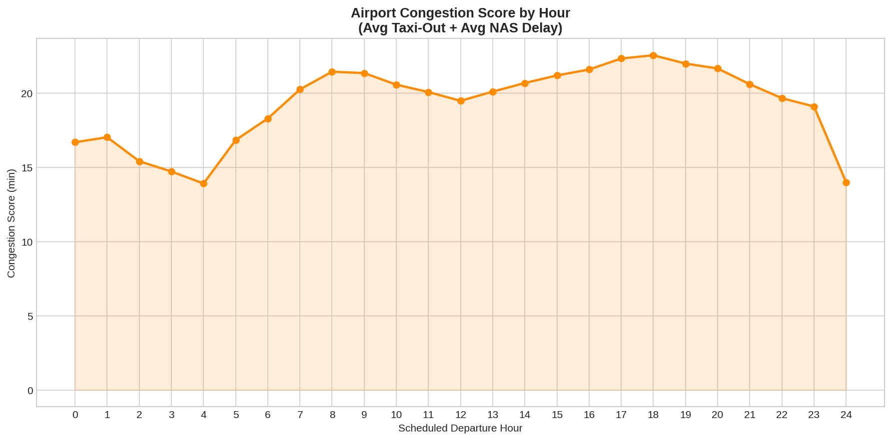
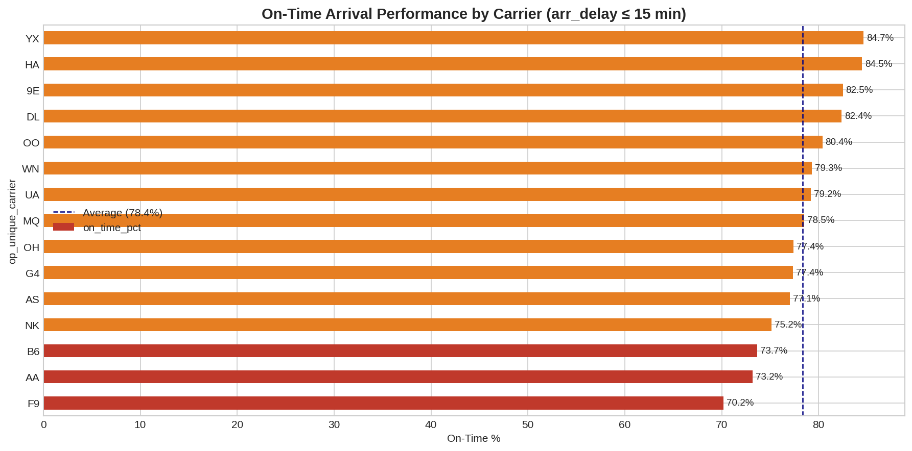
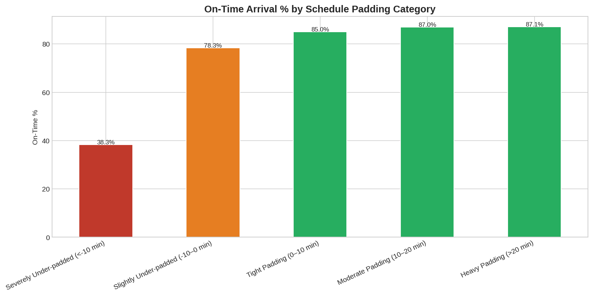
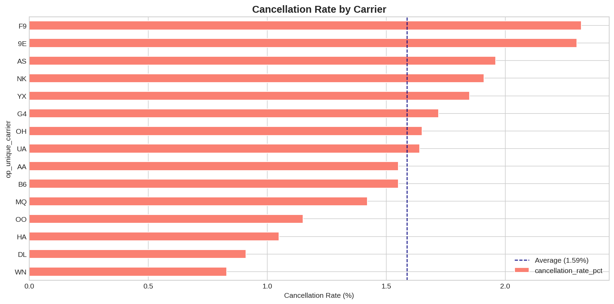
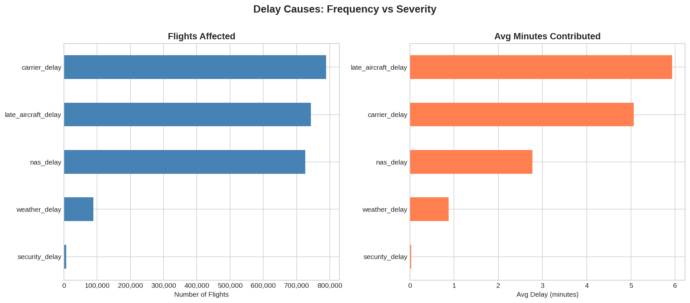
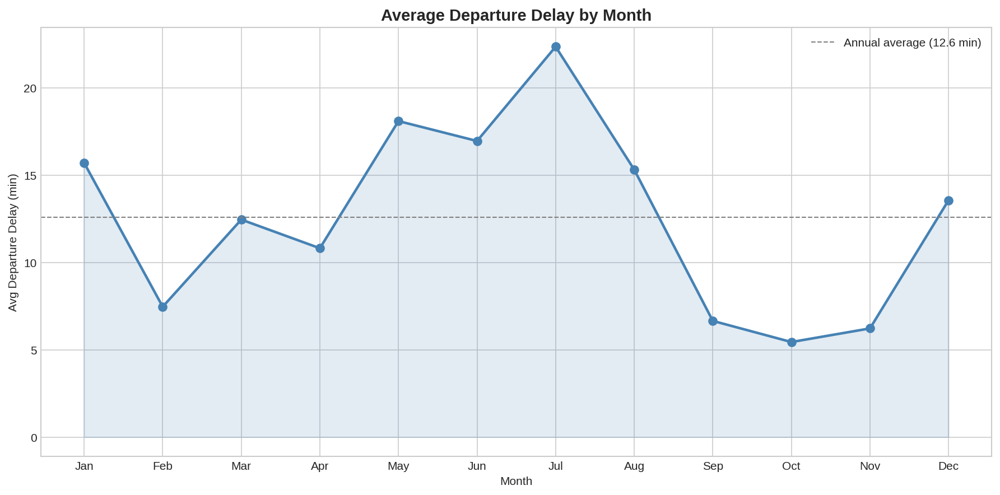
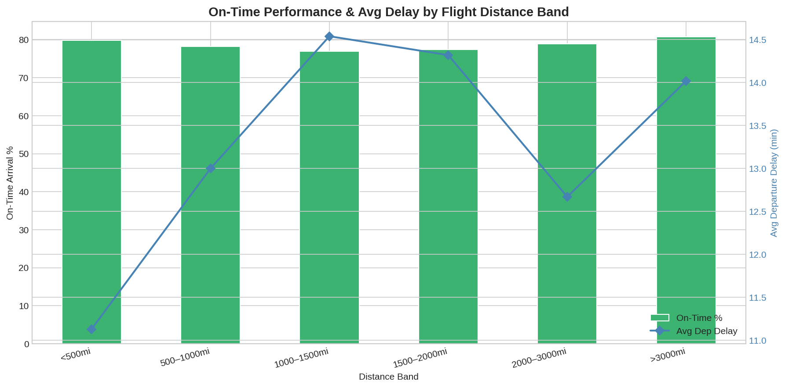

# Flight Data Analysis 2024 — Insights & Recommendations

---

## Table of Contents

1. [Executive Summary](#executive-summary)
2. [Data Overview](#data-overview)
3. [Airport Insights](#airport-insights)
4. [Carrier Performance](#carrier-performance)
5. [Delay Causes](#delay-causes)
6. [Temporal Patterns](#temporal-patterns)
7. [Route Analysis](#route-analysis)
8. [Recommendations](#recommendations)
9. [Limitations](#limitations)

---

## Executive Summary

This analysis examines US domestic flight performance across 2024 (6.19 million flights, 12 months), drawing on Bureau of Transportation Statistics (BTS) on-time performance data. The dataset covers departure and arrival delays, delay causes, cancellations, taxi times, and route-level detail across 15 carriers and hundreds of airports.

The headline finding is that flight delays in 2024 are systemic rather than random — they concentrate predictably by time of day, season, and carrier. However, several patterns commonly assumed to matter — distance, long-haul vs short-haul, and weekday vs weekend — turn out to have a much smaller effect than time of day and carrier identity.

Key takeaways:

- The best-performing carrier (YX, Endeavor Air) achieves **84.7% on-time arrival** versus **70.2%** for the worst (F9, Frontier) — a 14.5 percentage point gap
- **Time of day is the single strongest driver of delay risk**: on-time performance falls from 89.96% at 5am to 68.93% at 8pm — a 21 point swing across a single day
- **Distance is essentially irrelevant** to delay risk (correlation of 0.015 with departure delay). Long-haul and short-haul flights have almost identical average departure delays (12.89 vs 12.66 min)
- **Schedule padding has a dramatic effect on outcomes**: flights that are severely under-padded arrive on time only 38.3% of the time, versus 87.1% for heavily padded flights — a 49 point swing
- **Carrier-attributed delay** is the most frequent delay cause (788,965 flights), but **late aircraft delay** causes more minutes per flight on average (5.93 vs 5.06 min)

---

##  Key Findings

| Metric | Finding |
|--------|---------|
|  Best on-time carrier | YX (Endeavor Air) — 84.7% |
|  Worst on-time carrier | F9 (Frontier) — 70.2% |
|  Most common delay cause | carrier_delay — 788,965 flights affected |
|  Most severe delay cause | late_aircraft_delay — 5.93 min avg per flight |
|  Peak delay hour | 20:00 — avg 21.4 min, 68.9% OTP |
|  Best departure hour | 05:00 — avg 5.2 min, 90.0% OTP |
|  Worst season | Summer — avg 18.2 min delay |
|  Best season | Autumn — avg 6.1 min delay |
|  Best catch-up carrier | WN (Southwest) — 32.9% of late departures still arrive on time |
|  Highest cancellation rate | F9 (Frontier) — 2.32% |
|  Lowest cancellation rate | WN (Southwest) — 0.83% |
|  Most congested airport | JFK — congestion score 30.2 min |
|  Busiest airport | ATL — 341,910 flights |

---

## Data Overview

**Source:** Bureau of Transportation Statistics, On-Time Performance dataset
**Period:** January — December 2024 (full year, 6,192,585 flights)
**Scope:** US domestic scheduled flights, 15 carriers

**Key data quality decisions made in this analysis:**

The five cause-of-delay columns (`carrier_delay`, `weather_delay`, `nas_delay`, `security_delay`, `late_aircraft_delay`) are encoded as NULL by BTS when no delay of that type occurred, not as 0. Left uncorrected, this would inflate average delay figures. All five columns were null-filled to 0 prior to analysis.

Departure and arrival delay nulls — arising from ~106,919 cancelled and diverted flights — were left as NaN so they don't distort operational delay averages for flights that actually departed.

Outliers above the 99th percentile (dep_delay > 216 min OR arr_delay > 215 min) were flagged rather than removed — 74,938 flights (1.06% of the dataset). The impact is substantial and uneven across carriers:

| Carrier | With Outliers | Without Outliers | Difference |
|---------|--------------|-----------------|------------|
| AA | 20.70 min | 12.55 min | **8.15 min** |
| G4 | 14.05 min | 6.64 min | **7.41 min** |
| F9 | 19.00 min | 12.24 min | **6.76 min** |
| OH | 13.94 min | 7.61 min | **6.33 min** |
| B6 | 17.46 min | 11.98 min | **5.48 min** |
| OO | 11.28 min | 6.16 min | **5.12 min** |
| WN | 11.75 min | 10.55 min | 1.20 min |
| AS | 7.63 min | 6.34 min | 1.29 min |
| YX | 3.97 min | 1.97 min | 2.00 min |

AA's average departure delay drops by over 8 minutes once the top 1% of delays are excluded — the largest adjustment of any carrier, and a sign that AA's headline average is heavily influenced by a relatively small number of severe disruption events.

---

## Airport Insights

### Congestion

The composite congestion score (avg taxi-out + avg NAS delay) confirms that the most congested airports are concentrated in the northeast corridor: JFK (30.2 min), EWR (28.4 min), LGA (26.7 min), and BOS (24.1 min) all appear in the top 20, alongside Chicago O'Hare (27.3 min). Several smaller mountain/resort airports also rank highly — Aspen (ASE, 26.8), Hayden/Steamboat (HDN, 27.5), and Gunnison (GUC, 26.7) — likely driven by challenging terrain, weather, and limited runway capacity rather than sheer volume.

The least congested airports are almost entirely small regional and Alaska/Hawaii airports (WRG, ADQ, OTZ, ITO), where low traffic volume keeps both taxi times and NAS delay minimal.

Time of day matters significantly: congestion score rises from a low of ~13.9 at 4am to a peak of ~22.6 at 6pm before falling again overnight. This mirrors the late aircraft delay pattern almost exactly, reinforcing that afternoon/evening congestion is driven by accumulated schedule disruption rather than simply more flights being scheduled.

### Taxi-Out Times

JFK has the longest average taxi-out time of any major airport (26.3 min), followed by Newark (24.3 min) and O'Hare (23.8 min). The presence of low-volume airports like BGM, XWA, and HDN in the top 20 alongside high-volume hubs confirms that ground layout and local conditions — not just traffic volume — drive taxi delays.

### Late Aircraft Origin Airports

The airports with the highest average late aircraft delay are almost entirely small regional airports (MGW, EWN, SMX, VEL, EAU). This is consistent with these airports serving as endpoints of long, thin rotation chains — when the single daily aircraft serving these routes falls behind schedule anywhere upstream, there is no spare aircraft to substitute, so the delay shows up directly at these stations.

---

## Carrier Performance

### On-Time Performance

YX (Endeavor Air, a Delta regional subsidiary) leads with 84.7% on-time arrival, followed closely by HA (Hawaiian, 84.5%) and 9E (Endeavor's sister regional carrier, 82.5%). F9 (Frontier) trails the field at 70.2%, with AA (American Airlines, 73.2%) and B6 (JetBlue, 73.7%) close behind.

The top three carriers by OTP (YX, HA, 9E) are also the three with the lowest average departure delay AND the lowest percentage of severely late flights (>60 min). This is not a coincidence — their strong on-time performance is broad-based rather than driven by recovering well from bad starts.

### The Mean vs Median Gap

AA shows the starkest mean-median gap of any carrier: a mean departure delay of **20.70 minutes** but a median of **-1.0 minutes** — meaning the typical AA flight actually departs slightly early. AA's poor average is driven by a small share of badly disrupted flights — 10.21% of AA flights are delayed more than 60 minutes, the second-highest rate after F9 (10.90%).

YX sits at the opposite end: mean delay of 3.97 min, median of -5.0 min, and only 4.42% of flights severely late — the lowest of any carrier. YX's strong OTP is not a statistical artefact of padding (its average padding is mid-table at 5.67 min) — it reflects a genuinely tight, reliable operation.

### Schedule Padding

The raw correlation between schedule padding and arrival delay is -0.272, but the categorical breakdown tells a much stronger story:

| Padding Category | On-Time % | Avg Arrival Delay |
|-----------------|-----------|------------------|
| Severely Under-padded (<-10 min) | 38.3% | +43.4 min |
| Slightly Under-padded (-10–0 min) | 78.4% | +15.3 min |
| Tight Padding (0–10 min) | 85.0% | +4.5 min |
| Moderate Padding (10–20 min) | 87.0% | -2.7 min |
| Heavy Padding (>20 min) | 87.1% | -9.5 min |

The jump from "severely under-padded" to "tight padding" is enormous — a **46.7 percentage point** swing in on-time performance. However, returns diminish sharply after that: moving from "tight" to "heavy" padding adds only ~2 points of OTP. Airlines need *enough* padding to absorb typical variability, but beyond a threshold, additional buffer buys very little reliability — it just inflates block times.

WN, B6, 9E, NK, and DL build in the most average padding (6.4–6.6 min). HA pads the least by far (1.16 min) — consistent with Hawaii's relatively predictable, weather-stable short inter-island routes.

### The Catch-Up Factor

WN (Southwest) has the best catch-up factor at **32.9%** — nearly 1 in 3 flights that depart late still arrive on time or early. DL (30.0%) and UA (29.3%) follow closely. F9 has the worst catch-up rate at 19.0% — consistent with its poor overall performance across every other metric.

### Cancellations

F9 has both the largest on-time-performance gap AND the highest cancellation rate (2.32%), followed closely by 9E (2.30%). WN has the lowest cancellation rate (0.83%) — less than half the rate of the worst performers.

The cancellation reason breakdown adds important nuance. Overall, 55.7% of cancellations are weather-attributed, 32.1% carrier-attributed, and 12.2% NAS-attributed. But this varies enormously by carrier: OO (90.4%), AA (84.6%), and OH (86.6%) are dominated by weather cancellations, while AS (83.5%), HA (88.4%), DL (71.7%), and UA (65.4%) are dominated by carrier-attributed cancellations — within the airline's direct operational control. 9E (50.2% NAS), B6 (46.7% NAS), and YX (37.8% NAS) have unusually high NAS-attributed shares, likely reflecting their concentration in congested northeast airspace.

---

## Delay Causes

### Frequency vs Severity

By **number of flights affected:**

| Cause | Flights Affected |
|-------|-----------------|
| carrier_delay | 788,965 |
| late_aircraft_delay | 743,215 |
| nas_delay | 725,825 |
| weather_delay | 88,905 |
| security_delay | 7,406 |

By **average minutes contributed per flight** (across all flights):

| Cause | Avg Minutes |
|-------|------------|
| late_aircraft_delay | 5.93 min |
| carrier_delay | 5.06 min |
| nas_delay | 2.77 min |
| weather_delay | 0.88 min |
| security_delay | 0.03 min |

Carrier delay affects slightly more flights, but late aircraft delay is more severe per occurrence. Weather, despite being the most newsworthy delay cause, affects only 1.4% of flights and contributes less than 1 minute of average delay across the whole dataset — it is a minor operational factor, though it dominates cancellation reasons (55.7% of all cancellations).

### Late Aircraft by Carrier

F9 has by far the highest late aircraft delay (12.08 min avg) combined with the second-highest carrier delay (5.85 min) — a carrier compounding its own problems with knock-on effects from previous rotations. AA follows (10.66 late aircraft, 7.24 carrier delay — the highest carrier delay of any airline).

Most revealing is OO: it has a **low** late aircraft delay (2.85 min, third-lowest) but the **highest** carrier delay of any airline (7.64 min). OO's delay problem is internally generated (crew, maintenance, ground operations) rather than inherited from the network — which should make it more directly addressable.

### Seasonal Cause Breakdown

| Season | Carrier | Weather | NAS | Late Aircraft |
|--------|---------|---------|-----|---------------|
| Autumn | 3.48 | 0.40 | 1.67 | 3.29 |
| Spring | 4.98 | 0.89 | 3.23 | 6.67 |
| Summer | 6.83 | 1.05 | 3.47 | 8.07 |
| Winter | 4.84 | 1.16 | 2.67 | 5.56 |

Contrary to the common assumption that winter delays are weather-dominated, **weather delay is flat across all seasons** (0.40–1.16 min) and never the largest contributor in any season. Late aircraft and carrier delay dominate in every season and both peak in summer — summer's late aircraft delay (8.07 min) is more than double autumn's (3.29 min).

---

## Temporal Patterns

### Time of Day

This is the single clearest pattern in the dataset. On-time performance falls almost monotonically from 6am to 8pm:

| Hour | Avg Dep Delay | On-Time % |
|------|--------------|-----------|
| 05:00 | 5.2 min | 90.0% |
| 06:00 | 4.0 min | **89.5% ← best** |
| 08:00 | 5.8 min | 85.6% |
| 12:00 | 11.5 min | 80.3% |
| 16:00 | 17.3 min | 72.5% |
| 18:00 | 19.8 min | 70.0% |
| 20:00 | 21.4 min | **68.9% ← worst** |
| 23:00 | 15.4 min | 77.9% |

Late aircraft delay tracks this almost exactly — rising from 1.15 min at 6am to 10.63 min at 7pm. Each day "resets" close to on-time, and disruption accumulates as the day progresses.

### Day of Week

Friday is the worst day (14.66 min avg delay, 76.1% OTP), followed by Sunday (14.39 min, 76.8%). Tuesday and Wednesday are the best (10.46 and 10.42 min, ~81% OTP). At an aggregate weekday/weekend level the difference is small (12.34 vs 13.55 min), but **B6 has the largest weekend penalty of any carrier (+4.00 min worse on weekends)** — more than double the next-highest. 9E, HA, and MQ actually perform better on weekends.

### Seasonal Patterns

| Season | Avg Dep Delay |
|--------|--------------|
| Summer | 18.23 min ← worst |
| Spring | 13.83 min |
| Winter | 12.32 min |
| Autumn | 6.09 min ← best |

Summer is nearly **three times worse than autumn**. July is the single worst month (22.35 min). September (6.65), October (5.44), and November (6.22) are the three best months. January (15.70 min) stands out as a notable winter spike — post-holiday travel volume and winter weather combined.

---

## Route Analysis

### Best and Worst Routes

The worst-performing routes (min 50 flights) include RDM-DFW (49.2% OTP, avg +87.4 min arrival delay), ANC-ATL (39.5% OTP, +56.1 min), and EYW-DFW (52.3% OTP across 541 flights — a high-volume route with consistently poor performance).

The best-performing routes are concentrated on Hawaii/Pacific services: KOA-LAS (97.0% OTP, arriving on average 12.8 min early), GUM-SPN (96.7%), and several inter-island and Hawaii-mainland routes. These routes benefit from generous block times and stable Pacific weather.

### Distance and Delays

One of the most counter-intuitive findings in the dataset: **distance has almost no relationship with delay**. The correlation between distance and departure delay is 0.015, and with arrival delay is -0.006 — both effectively zero. Long-haul (12.89 min) and short-haul (12.66 min) average departure delays are nearly identical.

On-time performance is actually highest for the shortest (<500mi, 79.85%) and longest (>3000mi, 80.75%) distance bands, and lowest for the middle bands (1000–1500mi, 76.94%). Very short routes have simple, predictable operations; very long routes are operated with generous block times. Mid-distance routes may represent the worst of both worlds — long enough to accumulate delay risk, but not long enough to build in significant air-time recovery.

### Most Diverted Routes

LAS-HNL is the most frequently diverted route (88 diversions), followed by LAX-ASE (64) and LAS-OGG (60). Several top-diverted routes involve Las Vegas paired with Hawaii or mountain resort destinations — likely reflecting challenging approach conditions (Pacific weather, mountain terrain).

### Most At-Risk Flights

The highest average total delay flights are dominated by specific flight-number/route combinations on thin regional routes. Notably, the same routes appear in both directions (e.g. SYR↔DCA for OH, PIE↔CKB and GTF↔AZA for G4) — round-trip rotations where a single aircraft is structurally behind schedule for the entire day, affecting both legs.

---

## Recommendations

### For Passengers

**Fly before 9am whenever possible.** On-time performance falls from ~90% at 6am to ~69% at 8pm — a 21 point drop driven by schedule propagation. This is the single largest controllable delay factor available to a passenger.

**Prefer YX or HA; be cautious with F9 and AA.** The 14.5 percentage point OTP gap between YX and F9 is large enough to materially affect connection risk. AA's high mean delay is driven by a significant tail of extreme delays — 10.21% of AA flights are delayed more than 60 minutes.

**Don't worry about distance.** A long-haul flight is not meaningfully more or less likely to be delayed than a short hop. Carrier choice and departure time matter far more.

**Avoid Friday and Sunday departures where possible.** Tuesday and Wednesday consistently outperform by 4–5 percentage points. If B6 is your carrier, weekend departures specifically add ~4 minutes of average delay compared to weekdays.

**Build extra connection buffer in June–August.** Summer delays (18.2 min average) are nearly three times worse than autumn (6.1 min). A connection window comfortable in October may be tight in July.

### For Airlines

**F9 and AA should prioritise late aircraft and carrier delay reduction.** These two carriers have the highest combined late aircraft + carrier delay minutes (F9: 17.93 min combined, AA: 17.90 min combined). F9's cancellation problem has no single dominant root cause (carrier and weather are near-equal) — suggesting broad operational fragility.

**Target the "severely under-padded" tail, not maximal padding.** The data shows the biggest OTP gain (46.7 points) comes from moving flights out of the "severely under-padded" category into merely "tight padding" — not from maximising buffer. F9 and OH, with below-average padding and below-average OTP, are the best candidates for targeted padding increases.

**B6 should investigate weekend operations specifically.** A +4.00 min weekend penalty — the largest of any carrier by a wide margin — points to a specific weekend staffing or demand-handling issue distinct from B6's weekday performance.

**OO should focus on carrier-attributed delays.** OO has low late aircraft delay (2.85 min) but the highest carrier delay of any airline (7.64 min) — its problem is self-inflicted and directly within its operational control.

### For Airports

**The NYC corridor (JFK, EWR, LGA) and ORD should be the top priority** for congestion management. All four rank in the top 10 nationally by congestion score, and their afternoon/evening peak aligns with the network-wide late aircraft delay peak — improvements here would have ripple benefits across the whole system.

**ATL's sheer volume warrants ongoing monitoring.** As the busiest airport by a wide margin (341,910 flights — 28,000 more than second-place DFW), small per-flight inefficiencies compound to large absolute impacts, even if ATL's congestion score does not currently rank among the very worst.

---

## Limitations

### Data Limitations

**Self-reported delay causes.** BTS delay cause categories are reported by airlines themselves. Carrier_delay is the most frequently recorded cause in this dataset (788,965 flights) — but there is a well-documented tendency to under-report carrier-attributable delay and over-attribute to NAS or late aircraft. OO's unusually high carrier delay (7.64 min) relative to its late aircraft delay (2.85 min) may partly reflect more honest reporting rather than genuinely worse operations.

**No passenger-level data.** This dataset counts flights, not passengers. F9's 2.32% cancellation rate and YX's 84.7% OTP carry equal weight per flight regardless of aircraft size — a cancelled regional jet (YX/9E/OH typically operate 50–76 seat aircraft) affects far fewer passengers than a cancelled mainline widebody.

**Diverted flights are incomplete.** The diversion analysis identifies frequency (LAS-HNL: 88 diversions) but not outcome — whether passengers were re-routed same-day, bussed, or significantly delayed is not captured.

**No fare or yield data.** Whether F9's poor reliability is offset by lower fares is a commercial question this data cannot answer.

### Methodological Limitations

**Averages mask distributional differences.** AA's mean departure delay (20.70 min) vs median (-1.0 min) is the starkest example in the dataset — most AA flights depart on time, but 10.21% are delayed >60 minutes, pulling the average up substantially. Headline mean delay figures should always be read alongside the mean-median gap and the severe-delay percentage.

**Outlier treatment.** The 74,938 flagged outliers are not removed from headline figures. For AA specifically, removing them drops average departure delay from 20.70 to 12.55 min — a difference larger than the gap between several other carrier pairs. Carrier rankings by mean delay should be interpreted with this in mind.

**"Hour 24" anomaly.** A small number of flights coded with departure hour 24 show 100% OTP and 1.0 min average delay due to negligible volume. This is a data-coding artefact and was excluded from the time-of-day narrative.

**No causal inference.** The associations identified — between padding and OTP, between time of day and delay, between carrier and cancellation reason — describe correlations in 2024 data. They do not establish causation. The padding-OTP relationship could partly reflect that carriers with inherently more reliable operations choose to pad less, rather than padding alone driving outcomes.

**Single year of data.** 2024 may include carrier-specific events (fleet issues, labour actions) or unusual weather patterns that would not repeat in other years. Multi-year analysis would be needed to confirm these patterns are structural.

---

*Analysis conducted using Python, Pandas, Matplotlib, and Seaborn. Data sourced from https://www.kaggle.com/datasets/hrishitpatil/flight-data-2024/data*
