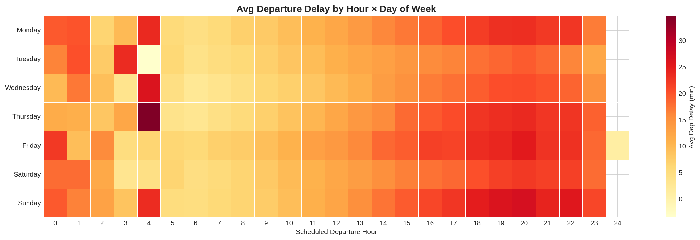

# US Flight Delay Analysis 2024

Python
Pandas
Matplotlib
Seaborn
Jupyter

Analysed more than 6.1 million US domestic flight records using Python and Pandas to investigate airline performance, airport congestion, operational delays, and cancellation patterns. Produced a comprehensive exploratory analysis with statistical comparisons, feature engineering, and data visualisations to identify the operational drivers of flight reliability and network performance.

 For the full breakdown of findings, recommendations, and limitations see [INSIGHTS.md](INSIGHTS.md)

---



---

##  Analysis Covered

**Airport Analysis**
- Busiest departure airports by flight volume
- Longest taxi-out times by airport
- Composite congestion scoring (taxi-out + NAS delay)
- Congestion patterns by time of day
- Late aircraft ripple effect origins

**Carrier Analysis**
- Mean vs median departure delay (outlier-adjusted)
- Delay magnitude distribution — not just averages, but how *bad* delays get
- On-time arrival performance (industry standard: arr_delay ≤ 15 min)
- Cancellation rates and cancellation reason breakdown
- Schedule padding strategy and its effectiveness
- Catch-up factor — how often carriers recover from a late departure
- Ground speed vs short/long-haul fleet mix
- Weekend vs weekday performance penalty

**Delay Cause Analysis**
- Frequency vs severity breakdown across all five BTS delay categories
- Seasonal cause breakdown (weather vs carrier vs NAS across seasons)
- Time-of-day OTP — quantifying the morning-to-evening reliability drop

**Temporal Patterns**
- Full day-of-week breakdown
- Weekday vs weekend comparison with cause-level detail
- Monthly and seasonal trends

**Route Analysis**
- Best and worst routes for on-time arrival (min 50 flights filter)
- Distance band analysis — delay and OTP % by mileage range
- Most at-risk individual flights by average total delay
- Most diverted routes

---

##  Tech Stack

- **Python**
- **Pandas** — data manipulation and aggregation
- **NumPy** — numerical operations
- **Matplotlib** — charting and visualisation
- **Seaborn** — heatmaps and statistical plots
- **Google Colab** — development environment

---

##  Project Structure

```
├── flight_analysis_2024.ipynb    
├── flight_analysis_2024.py       
├── INSIGHTS.md                    
├── images/                       
│   ├── otp_by_carrier.png
│   ├── delay_heatmap.png
│   ├── monthly_delay_trend.png
│   ├── delay_causes.png
│   ├── congestion_by_hour.png
│   ├── padding_effectiveness.png
│   ├── cancellation_rate.png
│   └── distance_otp.png
└── README.md
```

---

## How to Run

**In Google Colab (recommended)**
1. Open `flight_analysis_2024.ipynb` and click the **Open in Colab** badge at the top
2. Upload `flight_data_2024.csv` in google colab session
3. Run the code:

> **Note:** The dataset is ~6.19 million rows. Uploading directly to Colab's `/content/` folder might fail — in which case 
In Google Colab (recommended) if so:

1.Upload flight_data_2024.csv to your Google Drive
2.Open flight_analysis_2024.ipynb and click the Open in Colab badge at the top
3.Mount Google Drive and update the file path in Section 1:
```
from google.colab import drive
drive.mount('/content/drive')
df = pd.read_csv('/content/drive/MyDrive/flight_data_2024.csv', low_memory=False, on_bad_lines='skip')

```

**As a Python script**
1. Clone the repo
2. Update the file path in Section 1 to point to your local copy of `flight_data_2024.csv`
3. Run `python flight_analysis_2024.py`

Sections 1–4 handle loading, cleaning, and feature engineering. Sections 5–9 are the analyses. Section 10 generates all charts. Section 11 prints a summary of key findings.

---

## Data Source

https://www.kaggle.com/datasets/hrishitpatil/flight-data-2024/data?select=flight_data_2024.csv
